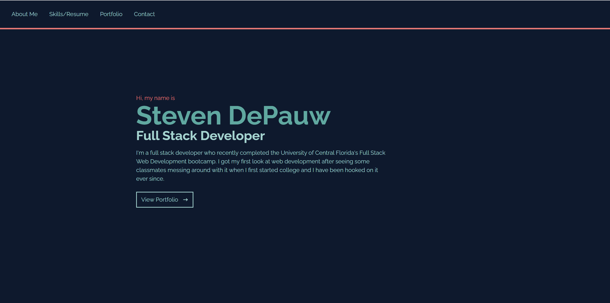

# Developed By DPow

##Description
This is my own personal portfolio page created by myself. It includes a functional nav bar for easily finding the specific sections of interest as well as direct links to view some of the things that I have worked on in the past. If there is any further questions or the desire to contact me my information is provided within the links to the forms of contact as well as there is a contact form at the very end to send me direct messages

## Mock-Up

The following image shows the web application's appearance and the link will take you directly to the app

For the full application follow this link: 

## Legal
For rules around using the GraphQL png pls refer to:
https://commons.wikimedia.org/wiki/File:GraphQL_Logo.svg
